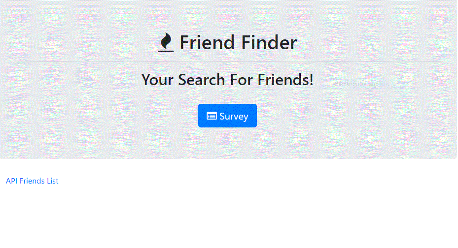
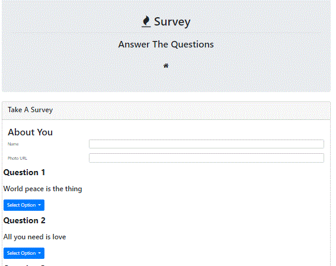
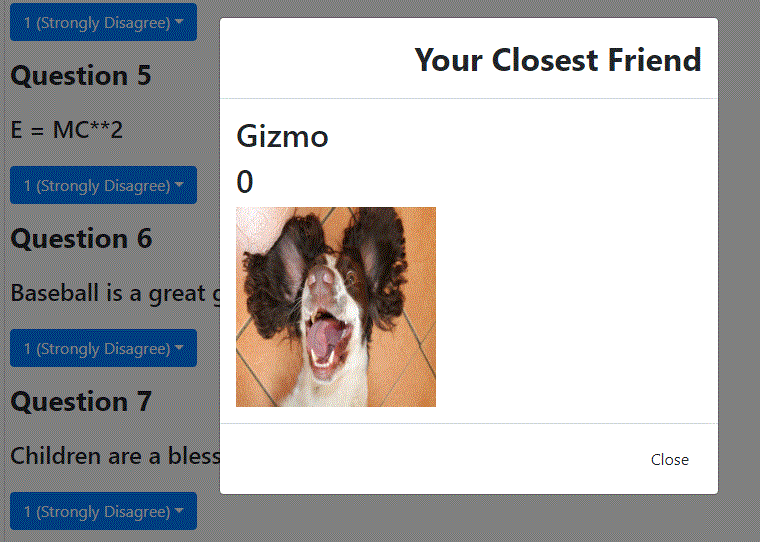

# Friend Finder - Node and Express Servers

### Overview

Build a compatibility-based "FriendFinder" application -- basically a dating app. This full-stack site takes in results from a users survey, then compares their answers with those from other users. The app then displays the name and picture of the user with the best overall match.

We use Express to handle the server and routing. The app is deployed to Heroku so other users can fill it out.

### GitHub Access

- [Source code repository](<https://github.com/pvraab/FriendFinder>)
- [Application URL](<https://pvraab-friendfinder.herokuapp.com/>) - Hosted on Heroku so we can run the Express server.

### Detailed Functionality

- On application start, a splash page is displayed with the option to take a survey.



- Select the survey option by clicking on the "Survey" button. This will bring up the survey page.

- The user enters their name and a URL pointing to the photo they wish to use. Then the user enters answers to 10 questions and clicks on the submit form at the end of the survey. Each answer is based on a scale of 1 to 5 based on how much the user agrees or disagrees with a question. The best match is then displayed in a Modal.




### Development Steps

- Created a folder called `FriendFinder`. Inside the folder, organized the application code into  directories as:

  ```
  FriendFinder
    - .gitignore
    - app
      - data
        - friends.js
      - public
        - home.html
        - survey.html
      - routing
        - apiRoutes.js
        - htmlRoutes.js
    - node_modules
    - package.json
    - server.js
  ```

- The`server.js` file requires the npm package `express` to create and start the server.

- The`htmlRoutes.js` file includes two routes:

  - A GET Route to `/survey` which will display the survey page.
  - A default, catch-all route that leads to `home.html` which displays the home page.

- The`apiRoutes.js` file contains two routes:

  - A GET route with the url `/api/friends`. This is used to display a JSON of all possible friends.

  

  - A POST routes `/api/friends`. This is used to handle incoming survey results. This route will also be used to handle the compatibility logic.

- Save the application's data inside of `app/data/friends.js` as an array of objects. Each of these objects follows the format below.
```json
{
  "name":"Ahmed",
  "photo":"https://media.licdn.com/mpr/mpr/shrinknp_400_400/p/6/005/064/1bd/3435aa3.jpg",
  "scores":[
      5,
      1,
      4,
      4,
      5,
      1,
      2,
      5,
      4,
      1
    ]
}
```


- Determine the user's most compatible friend as:
  - Convert each user's results into a simple array of numbers (ex: `[5, 1, 4, 4, 5, 1, 2, 5, 4, 1]`).
- With that done, compare the difference between current user's scores against those from other users, question by question. Add up the differences to calculate the `totalDifference`.

  - Example:

    - User 1: `[5, 1, 4, 4, 5, 1, 2, 5, 4, 1]`

    - User 2: `[3, 2, 6, 4, 5, 1, 2, 5, 4, 1]`

    - Total Difference: **2 + 1 + 2 =** **_5_**

  - Use the absolute value of the differences. Put another way: no negative solutions! Calculate both `5-3` and `3-5` as `2`, and so on.
- The closest match is  the user with the least amount of difference.
- The current user's most compatible friend, display the result as a modal pop-up.

- A modal displays both the name and picture of the closest match.

### Technologies Used

- JavaScript
- jQuery
- Express
- AJAX
- npm package path
- Modal
- BootStrap

### Portfolio

Click on my Portfolio at my portfolio page at: <https://pvraab.github.io/RaabPortfolio/> to see the link to this app.